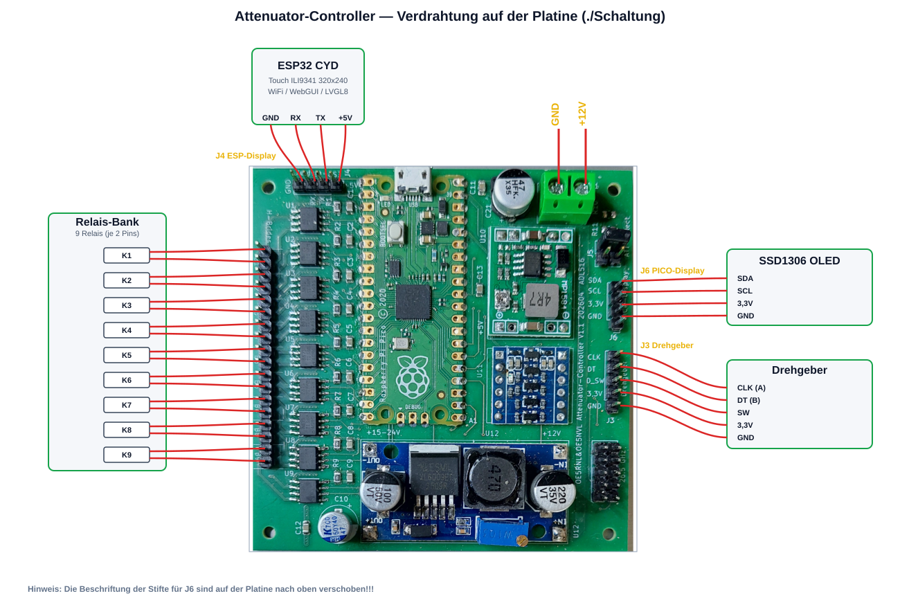

# Attenuator Controller

Das Projekt realisiert einen Controller für RF-Attenuators (HF-Dämpfungsglieder).


Es besteht aus einer Basisplatine und den optionalen Bendienelementen:  
* Ein ESP32 CYD Touch-Display  
* Ein 2.8" OLED Display  
* Einen Drehgeber mit Druckschalter  

Der Betrieb kann in folgenden Varianten erfolgen. Basisplatine **und**:  
* Nur ESP Touch Display
* OLED Display und Drehgeber
* ESP Touch Display und oder/und OLED sowie oder/und Drehgeber 

### Firmware installieren (ohne Installation)

Für Endnutzer gibt es im Ordner [install/](install/) einen Offline-Flasher, der
ohne PlatformIO oder Python auskommt — es wird nur ein mitgeliefertes Programm
aufgerufen. Details siehe [install/README.md](install/README.md).

- **ESP32:** Board per USB anstecken und `flash-esp32.sh` (Linux) bzw.
  `flash-esp32.bat` (Windows) ausführen. Der serielle Port wird automatisch
  erkannt; das eigenständige `esptool` ist bereits enthalten.
- **Pico:** **BOOTSEL** gedrückt halten, einstecken und `firmware/firmware.uf2`
  auf das Laufwerk `RPI-RP2` kopieren — ganz ohne Zusatzprogramm.

> **Hinweis:** Die auslieferbaren Firmware-Dateien werden vom Entwickler einmalig
> per [install/export.sh](install/export.sh) erzeugt (baut ESP32 + Pico und legt
> `firmware-merged.bin` sowie `firmware.uf2` in `install/firmware/` ab).

---

## Systemübersicht

ESP32 CYD (Touch-Display 320×240, WebGUI via WiFi, LVGL 8 UI) kommuniziert über
UART (115200 Baud) mit dem Raspberry Pi Pico (Drehgeber, SSD1306 OLED). Beide
steuern gemeinsam die Attenuator-Relais.



Der am häufigsten Abzutreffende Attenuatos ist die 135dB Variante.  
Siehe dazu zur Verkabelung ATT_135db.md  
Test der EinzelRelais mit dem Testmenü am Display und auf der Webseite.

### ESP32 — Touch-Controller

LVGL-8-Steuerungsoberfläche auf ESP32 CYD (Cheap Yellow Display):

- 2.8" Touch-Display ILI9341 (320×240), Variante CYD2USB mit ST7789
- WLAN: AP-Modus und Client-Modus gleichzeitig
- WebGUI mit identischer Funktion wie das Touch-Display
- NVS-Persistenz (Wert, Presets, WiFi-Modus, Set-Modus)
- FreeRTOS Dual-Core: LVGL/UI auf Core 1, WebSocket/WiFi auf Core 0
- Kommunikation mit dem Pico über UART0

### Pico — Relais-/Drehgeber-Controller

Raspberry Pi Pico als Attenuator-Controller:

- Drehgeber zur Auswahl und Aktivierung von Dämpfungswerten
- Optionales SSD1306 OLED-Display (I2C)
- Automatische Attenuator-Erkennung über ADC (Spannungsteiler an GP26 / ADC0)
- Bis zu 8 bistabile Relais (H-Brücke oder Einzel-Pin)
- Serielle Steuerung über UART vom ESP32

---

## Unterstützte Attenuatoren

Quelle: [pico/src/Attenuator.cpp](pico/src/Attenuator.cpp),
[pico/src/att_types.h](pico/src/att_types.h) und die jeweiligen `att_*`-Klassen.

| Typ | Max. dB | Schritte | Relay-Modus | Status im Code |
|-----|--------:|---------:|-------------|----------------|
| R&S 26.5 GHz | 110 dB | 10 dB | Static (Einzelpin) | implementiert (`Att26GHz`) |
| R&S RS-135 dB | 135 dB | 5 dB | Bridge (H-Brücke) | implementiert (`Att135dB`) |
| RS-141 dB | (variable Pads) | — | Bridge (H-Brücke) | implementiert (`Att141dB`) |
| Typ B | — | — | — | **nicht** implementiert (`AttB` → „NOT IMPLEMENTED") |

### Automatische Erkennung über ADC (GP26 / ADC0)

**Maßgeblich ist der Code** in [pico/src/main.cpp](pico/src/main.cpp) (`getAttenuator()`):

| Spannung (v) | Erkannter Attenuator |
|--------------|----------------------|
| 0.0 V ≤ v < 0.7 V | RS-141 dB |
| 0.9 V ≤ v < 1.5 V | 26.5 GHz |
| 1.7 V ≤ v < 2.3 V | Typ B |
| 2.4 V ≤ v ≤ 3.3 V | RS-135 dB |
| außerhalb aller Fenster | **NOT IMPLEMENTED** — kein Attenuator, kein GPIO wird gesetzt |

> **Hinweis:** Die alten READMEs und der Kommentar in
> [pico/src/att_types.h](pico/src/att_types.h) nennen eine andere Zuordnung
> (0.0–0.8 V → 26.5 GHz usw.). Diese stimmt **nicht** mit dem aktuellen Code
> überein. Ungültige Spannungen (Lücken 0.7–0.9 / 1.5–1.7 / 2.3–2.4 V sowie alles
> außerhalb) liefern `getAttenuator()` = `-1`; `create_attenuator()` gibt dann
> `nullptr` zurück, es wird **kein GPIO** aktiviert und das Display zeigt
> „NOT IMPLEMENTED".

### Widerstände für den Spannungsteiler

R10 nach 3,3 V, R11 nach GND (an Pico ADC):

```
 3,3V
  |
 R10
  |---- Pico ADC (GP26)
  |
 R11
  |
 GND
```

| Attenuator | R10 | R11 |
|------------|-----|-----|
| 26.5 GHz | offen | offen |
| RS-141 dB | 3k3 | 4k7 |
| Typ B | 4k7 | 3k3 |
| RS-135 dB | 0 Ohm | offen |

> **ACHTUNG:** Niemals zwei 0-Ohm-Widerstände einbauen — das kurzschließt den
> 3,3-V-Ausgang des Pico.
>
> **ACHTUNG:** Vor dem Verbinden des Attenuators mit der Steuerplatine am Display
> prüfen, ob der gewünschte Attenuator angezeigt wird. Wird `ATTENUATOR_26_5GHz`
> eingestellt, aber ein Attenuator mit H-Brücken-Ansteuerung verwendet, kann es
> zur Zerstörung der Relais führen.

---

## Hardware


### Pico — GPIO-Belegung


| Pin | GPIO | Funktion |
|-----|------|----------|
| 1  | GP0  | TX → ESP32 (Serial1) |
| 2  | GP1  | RX ← ESP32 (Serial1) |
| 4  | GP2  | Relais 1a |
| 5  | GP3  | Relais 1b |
| 6  | GP4  | I2C SDA (Display) |
| 7  | GP5  | I2C SCL (Display) |
| 9  | GP6  | Relais 2a |
| 10 | GP7  | Relais 2b |
| 11 | GP8  | Relais 3a |
| 12 | GP9  | Relais 3b |
| 14 | GP10 | Relais 4a |
| 15 | GP11 | Relais 4b |
| 16 | GP12 | Relais 5a |
| 17 | GP13 | Relais 5b |
| 19 | GP14 | Relais 6a |
| 20 | GP15 | Relais 6b |
| 21 | GP16 | Relais 7a |
| 22 | GP17 | Relais 7a |
| 24 | GP18 | Relais 8a |
| 25 | GP19 | Encoder SW |
| 26 | GP20 | Encoder DT (B) |   
| 27 | GP21 | Encoder CLK (A) |
| 29 | GP22 | Relais 8b |
| 31 | GP26 | ADC0 — Attenuator-Erkennung |
| 32 | GP27 | Relais 9a |
| 34 | GP28 | Relais 9b |

#### Relais-Mapping RS-135 dB (bistabil, ON/OFF-Pin-Paare)

Quelle: [pico/src/att_135db.h](pico/src/att_135db.h) / [.cpp](pico/src/att_135db.cpp).


| Relais | ON-Pin | OFF-Pin | tatsächlicher Pad-Wert |
|--------|--------|---------|------------------------|
| U1 (40bB A) | GP3 | GP2 | 40 dB |
| U2 (20dB A) | GP7 | GP6 | 20 dB |
| U3 (5 dB) | GP9 | GP8 | 5 dB |
| U4 (20dB B) | GP11 | GP10 | 20 dB |
| U5 (10 dB) | GP13 | GP12 | 10 dB |
| U6 (40dB B) | GP15 | GP14 | 40 dB |
| U7 (RF) | GP17 | GP16 | RF ON/OFF |

#### Relais-Mapping 26.5 GHz (Static, HIGH = aktiv)

Quelle: [pico/src/att_26ghz.h](pico/src/att_26ghz.h).

| Pad | GPIO | Pin |
|-----|------|-----|
| 10 dB | GP10 | 14 |
| 20 dB | GP11 | 15 |
| 40 dB (A) | GP12 | 16 |
| 40 dB (B) | GP13 | 17 |


---

## WiFi-Konfiguration

### WiFi-Credentials einstellen

Erstelle `esp32/src/wifi_credentials.h` mit deinen WLAN-Zugangsdaten (Vorlage:
[esp32/src/wifi_credentials.h.example](esp32/src/wifi_credentials.h.example)):

Der AP ist unabhängig von der Datei stets erreichbar. Die Client-Anbindung ans Heimnetz kann man jederzeit zur Laufzeit über die WebGUII (WLAN-Suche → Verbinden) oder das Display setzen — die Werte landen im NVS. wifi_credentials.h ist nur praktisch, wenn man die Zugangsdaten schon beim Kompilieren fest hinterlegen will (z. B. damit sich das Gerät ohne manuelle Ersteinrichtung direkt verbindet).


```cpp
#pragma once
#define WIFI_SSID     "DeinSSID"
#define WIFI_PASSWORD "DeinPasswort"
```

Diese Datei ist in [.gitignore](.gitignore) und wird nicht committet.

### WiFi-Modi

Quelle: [esp32/src/webserver.h](esp32/src/webserver.h) (`apply_wifi_mode()`).

Es gibt genau **zwei** Modi; jeder von 0 verschiedene Wert wird intern auf `2`
gesetzt. Die Einstellung wird im NVS (`wmode`) gespeichert.

- **Modus 0 (Aus):** WiFi vollständig deaktiviert (`WIFI_OFF`), Webserver und AP
  werden gestoppt, mDNS beendet.
- **Modus 2 (AP + Client):** Der Access Point ist **immer** aktiv. Ein
  Client (STA) wird zusätzlich nur gestartet, wenn gültige Client-Zugangsdaten
  vorliegen — andernfalls läuft das Gerät im AP-only-Betrieb.
  - AP-SSID: `ESP32-ATT`
  - AP-Passwort: `12345678` (Standardwert — bitte ändern)
  - AP-IP: `192.168.4.1`
  - Client-Zugangsdaten stammen aus dem NVS (`wifi_ssid` / `wifi_pass`),
    vorbelegt aus [esp32/src/wifi_credentials.h](esp32/src/wifi_credentials.h);
    zur Laufzeit über das Display-Menü (**Menu → WLAN**) bzw. die WLAN-Suche der
    WebGUI setzbar.
  - Die Client-Verbindung erfolgt nicht blockierend; nach Timeout (ca. 20 s) oder
    bei Fehler fällt das Gerät automatisch auf AP-only zurück.
  - mDNS (`esp32-att.local`) wird erst nach erfolgreicher Client-Verbindung
    aktiviert.

### WebGUI

Nach dem Start erreichbar unter:
- **AP-Modus:** `http://192.168.4.1`
- **Client-Modus:** `http://esp32-att.local` (oder die angezeigte IP)


---

## Quick Start

### ESP32 flashen
```bash
cd esp32
./upload.sh
# oder manuell:
~/.platformio/penv/bin/pio run -t upload
~/.platformio/penv/bin/pio device monitor
# CYD2USB-Variante (ST7789):
~/.platformio/penv/bin/pio run -e cyd2usb -t upload
```

### Pico flashen
```bash
cd pico
./upload_main.sh
# oder manuell:
~/.platformio/penv/bin/pio run -t upload
~/.platformio/penv/bin/pio device monitor
```

> **Tipp:** Falls `pio: command not found` erscheint, den vollen Pfad
> `~/.platformio/penv/bin/pio` verwenden oder PlatformIO global installieren.

**Voraussetzungen:** [PlatformIO](https://platformio.org/) (CLI oder VS-Code-Extension).

### Tools einrichten

1. **Repository holen**
   ```bash
   git clone <REPO-URL>
   cd ESP32-ATT-C-LVGL8
   ```

2. **PlatformIO installieren** — eine der beiden Varianten:
   - **VS Code + Extension (empfohlen):** [VS Code](https://code.visualstudio.com/)
     installieren, dann die Extension **PlatformIO IDE** hinzufügen. Build/Upload
     erfolgen über die PlatformIO-Toolbar.
   - **CLI (Kommandozeile):**
     ```bash
     python3 -m pip install --user platformio
     # oder das offizielle Installskript:
     # curl -fsSL https://raw.githubusercontent.com/platformio/platformio-core-installer/master/get-platformio.py | python3
     ```
     Danach steht `pio` unter `~/.platformio/penv/bin/pio` zur Verfügung
     (ggf. in den `PATH` aufnehmen).

3. **Toolchains & Bibliotheken** — werden beim ersten `pio run` automatisch
   geladen (Platforms `espressif32` und `raspberrypi`, Frameworks und alle
   `lib_deps` aus den jeweiligen [platformio.ini](esp32/platformio.ini)).
   Eine manuelle Installation ist nicht nötig.

4. **Serielle Rechte (Linux):** Für Upload/Monitor den eigenen Benutzer zur
   Gruppe `dialout` hinzufügen und neu anmelden:
   ```bash
   sudo usermod -aG dialout $USER
   ```

5. **WLAN-Zugangsdaten (optional):** Nur nötig, wenn die Client-Zugangsdaten
   bereits beim Kompilieren fest hinterlegt werden sollen — siehe Abschnitt
   „WiFi-Credentials einstellen". Ohne diese Datei ist der Access Point trotzdem
   erreichbar; die Client-Anbindung lässt sich zur Laufzeit über WebGUI/Display
   setzen.

---

## Serielles Kommunikationsprotokoll (UART, 115200 Baud)

Alle Nachrichten sind ASCII-Zeilen, abgeschlossen mit `\n`.

### Pico → ESP32

**Startup-Info** (einmalig nach Pico-Reset):

| Befehl | Beschreibung |
|--------|--------------|
| `RELAYS:<n>` | Anzahl der Relais |
| `ATTNAME:<name>` | Attenuator-Name |
| `STEP:<n>` | Schrittweite in dB |
| `MAXDB:<n>` | Maximalwert in dB |
| `RELMODE:<n>` | Relay-Modus: `0`=Bridge, `1`=Static |
| `RFSWITCH:<n>` | RF-Schalter vorhanden: `0`/`1` |
| `PICOVER:<ver>` | Pico-Firmware-Version |

**Laufzeit:**

| Befehl | Beschreibung |
|--------|--------------|
| `<n>dB` | Aktueller Dämpfungswert (Display-Sync) |
| `SEL<n>` | Ausgewählte Stelle: `0`=Hunderter, `1`=Zehner, `2`=Einer |
| `SETMODE:<n>` | Set-Modus: `0`=Direct, `1`=Time, `2`=Button |
| `RF:<n>` | RF-Schalter-Zustand: `0`/`1` |
| `TESTSTATE:<i>,<s>` | Test: Relais-Index `i`, Zustand `s` (`0`/`1`) |
| `SETOK` | Pico hat im Set-Button-Modus angewendet |

### ESP32 → Pico

| Befehl | Beschreibung |
|--------|--------------|
| `<n>dB` | Dämpfung Display-Sync (kein Schalten) |
| `SET:<n>dB` | Dämpfung sofort schalten (Relais) |
| `TIMED:<n>dB` | Zeitgesteuert schalten |
| `SEL<n>` | Aktive Stelle ändern |
| `SETMODE:<n>` | Set-Modus umschalten |
| `RF:<n>` | RF-Schalter setzen: `0`/`1` |
| `TEST:START` | Relay-Test starten |
| `TEST:SEL:<i>` | Test-Relais `i` auswählen |
| `TEST:ACTION` | Test: Puls/Toggle am gewählten Relais |
| `TEST:END` | Test beenden |

---

## Implementierungsdetails ESP32

| Core | Aufgaben |
|------|----------|
| **Core 0** | WiFi-Stack, AsyncTCP, ESPAsyncWebServer, WebSocket-Callbacks |
| **Core 1** | `setup()` / `loop()`, LVGL `lv_timer_handler()`, UART-Empfang |

Kommunikation zwischen den Cores über FreeRTOS-Queue (`xQueueSend` / `xQueueReceive`).

---

## Projektstruktur

```
ESP32-ATT-C-LVGL8/
├── shared/
│   └── version.h               # Versionsnummern ESP32 + Pico (0.51)
├── esp32/
│   ├── platformio.ini          # PlatformIO + TFT_eSPI Build-Flags
│   ├── lv_conf.h               # LVGL-8-Konfiguration
│   └── src/
│       ├── main.cpp            # LVGL UI, UART-Kommunikation
│       ├── webserver.h         # AsyncWebServer, WebSocket, HTML
│       ├── wifi_credentials.h  # WLAN-Zugangsdaten (nicht im Repo)
│       └── lv_font_digits_72.c # Custom 72 px Ziffern-Font
├── pico/
│   └── src/
│       ├── main.cpp            # Hauptprogramm, UART, Encoder, ADC-Erkennung
│       ├── Attenuator.h/.cpp   # Abstrakte Basisklasse + Factory
│       ├── att_26ghz.h/.cpp    # R&S 26.5 GHz (Static, 110 dB / 10 dB)
│       ├── att_135db.h/.cpp    # R&S 135 dB (Bridge, 135 dB / 5 dB)
│       ├── att_141db.h/.cpp    # RS-141 dB (Bridge)
│       ├── att_b.h/.cpp        # Typ B (nicht implementiert)
│       ├── att_types.h         # Typ-Konstanten + ADC-Grenzwerte (Kommentar veraltet)
│       ├── test.h/.cpp         # Relay-Testmodus
│       ├── SSD1306.h/.cpp      # OLED-Display-Treiber
│       ├── big_digits.h        # Große Ziffern für OLED
│       ├── font.h              # OLED-Font
│       └── toggle_gpio10_13.cpp # Standalone-GPIO-Testhilfe
├── Schaltung/                  # KiCad Schaltplan + PCB
├── install/                    # Offline-Flasher (esptool + Skripte, ohne Installation)
└── docs/                       # Zusätzliche Dokumentation
```

---

## Lizenz

MIT — siehe [LICENSE](LICENSE).

Ausnahme: Der Ordner [esp32/docu/esp32-display/](esp32/docu/esp32-display/)
enthält Hersteller-Dokumentation (Sunton) und ist **nicht** von der MIT-Lizenz
abgedeckt.

Build by OE5RNL & OE5NVL & Chatgpt & Claude

### Haftungsausschluss

Diese Hard- und Software wird „wie besehen" ohne jegliche Gewährleistung
bereitgestellt — weder ausdrücklich noch stillschweigend, insbesondere keine
Gewährleistung der Marktgängigkeit oder Eignung für einen bestimmten Zweck.
Die Nutzung erfolgt auf eigene Gefahr. Die Autoren übernehmen keine Haftung für
Schäden jeglicher Art (z. B. an Attenuatoren, Relais, Messgeräten oder sonstiger
Ausrüstung), die aus dem Aufbau, dem Betrieb oder der Nutzung dieses Projekts
entstehen.

Insbesondere kann eine falsche Attenuator-Erkennung oder fehlerhafte Verdrahtung
zur Zerstörung der Relais oder des angeschlossenen Dämpfungsglieds führen (siehe
Warnhinweise im Abschnitt „Widerstände für den Spannungsteiler"). Vor dem
Anschluss stets prüfen, ob der korrekte Attenuator angezeigt wird.

## Basiert auf

[ESP32-Cheap-Yellow-Display](https://github.com/witnessmenow/ESP32-Cheap-Yellow-Display)
— LVGL8-Beispiel.
